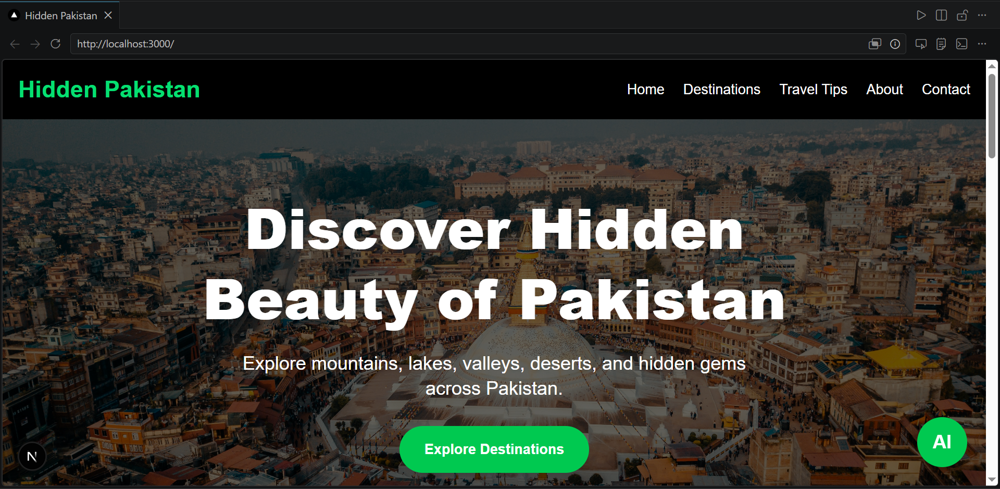
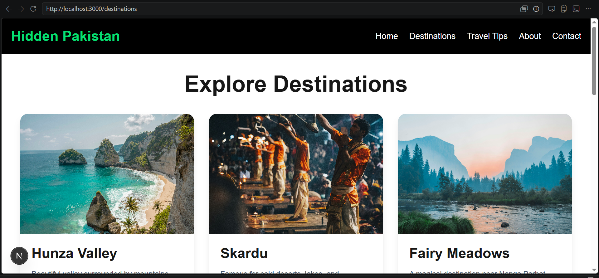
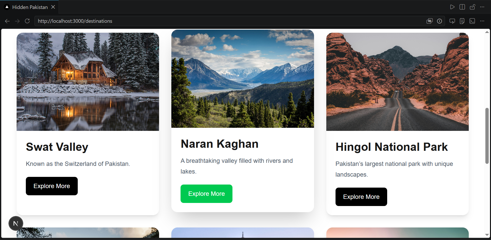
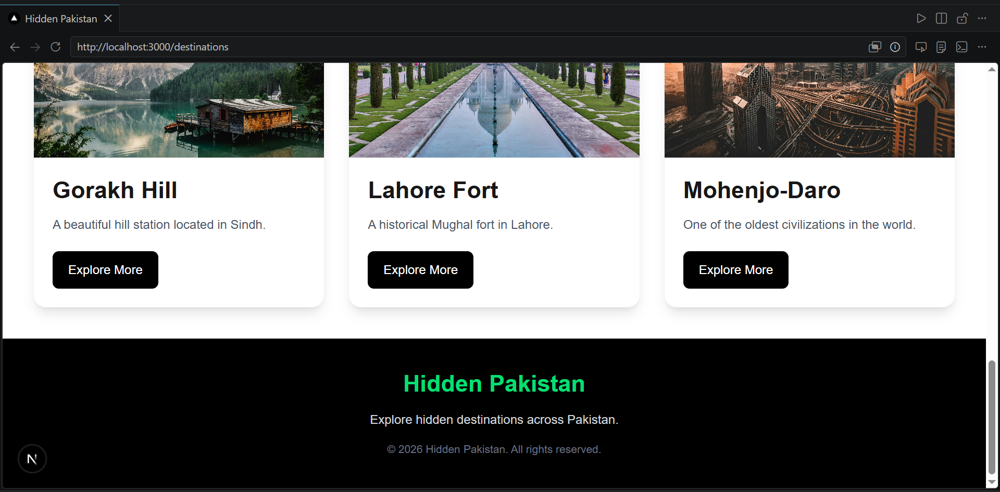
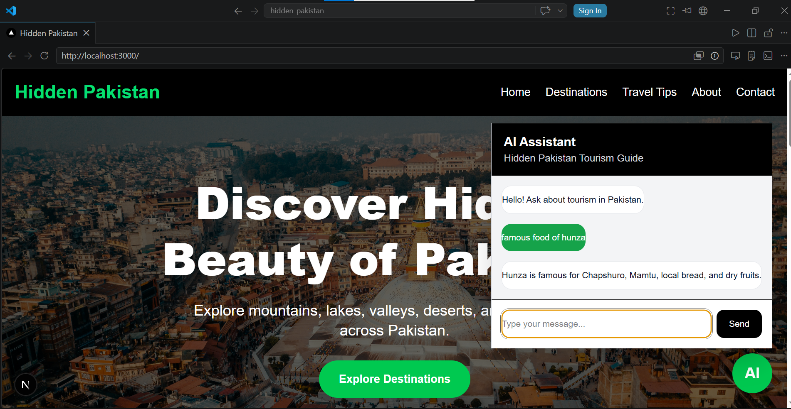
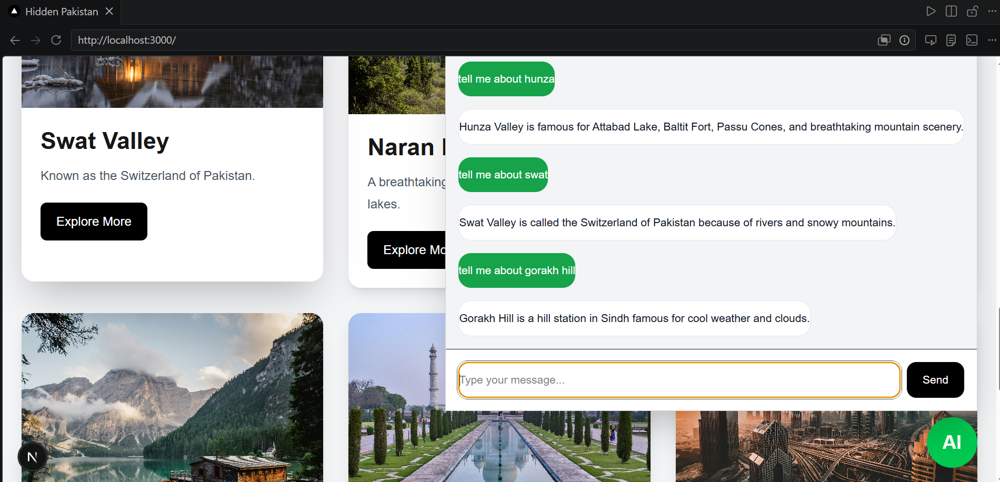
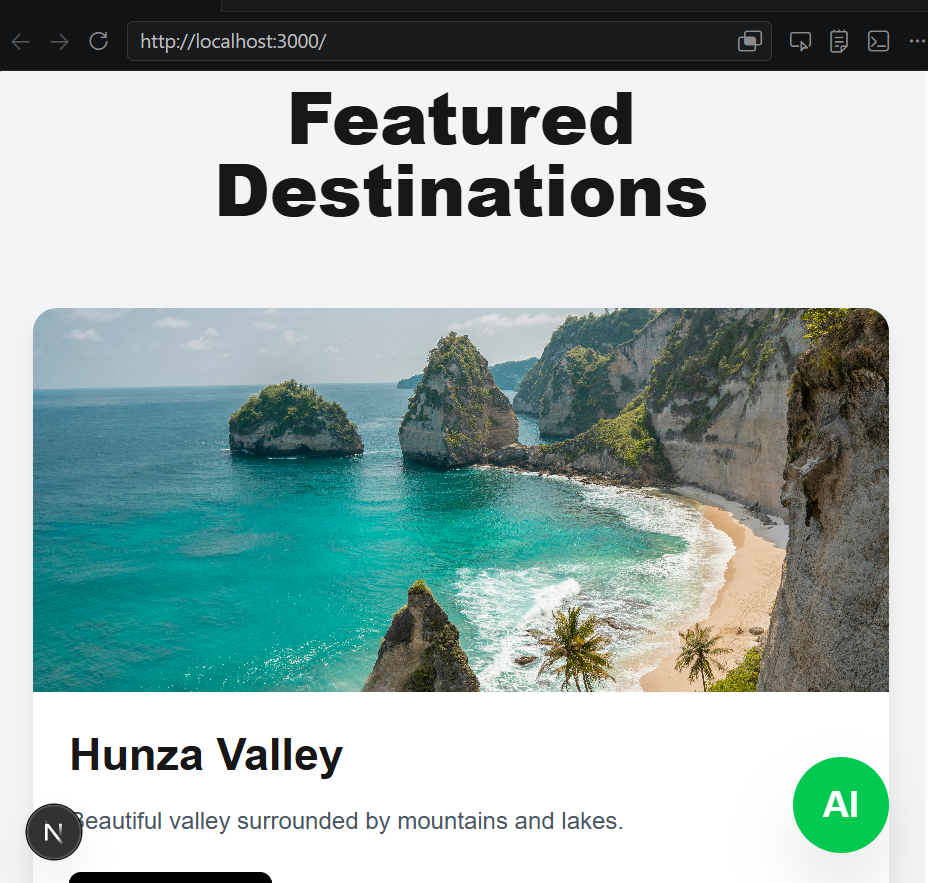
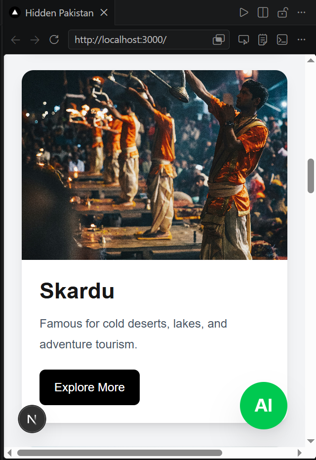
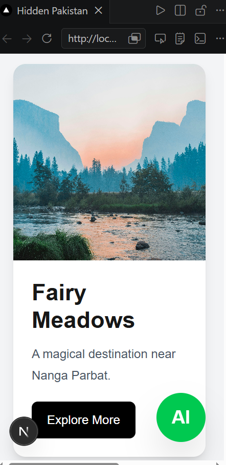

# Hidden Pakistan – AI Tourism Website

## Project Overview

Hidden Pakistan is an AI-powered tourism website developed to promote the beauty, culture, and tourist destinations of Pakistan. The platform provides users with information about famous travel locations, travel tips, and an integrated AI chatbot that answers tourism-related queries.

The project is designed using modern web technologies with a responsive and user-friendly interface.

---

# Features

- AI-powered tourism chatbot
- Responsive modern UI
- Multiple tourism destination pages
- About page
- Contact page
- Travel tips section
- FastAPI backend integration
- Dynamic chat interface
- Clean and organized project structure
- Spec-Kit Plus documentation included

---

# Technologies Used

## Frontend
- Next.js
- React
- TypeScript
- Tailwind CSS

## Backend
- FastAPI
- Python

## AI & Data
- Qdrant Vector Database
- Tourism Knowledge Base

## Development Tools
- VS Code
- GitHub
- Vercel

---

# Project Structure

hidden-pakistan/
│
├── .next/                      # Next.js build output (auto-generated)
│
├── .spec/                     # Spec-Kit documentation
│   ├── memory/
│   ├── skills/
│   ├── tasks/
│   │   ├── 001-setup.md
│   │   ├── 002-navbar.md
│   │   ├── 003-homepage.md
│   │   ├── 004-destinations.md
│   │   ├── 005-about.md
│   │   ├── 006-chatbot.md
│   │   ├── 007-testing.md
│   │   └── 008-deployment.md
│   ├── constitution.md
│   └── plan.md
│
├── app/                       # Next.js App Router
│   ├── about/
│   │   └── page.tsx
│   ├── contact/
│   │   └── page.tsx
│   ├── destinations/
│   │   └── page.tsx
│   ├── tips/
│   │   └── page.tsx
│   ├── layout.tsx
│   ├── page.tsx
│   ├── globals.css
│   └── favicon.ico
│
├── backend/                   # FastAPI backend
│   ├── routers/
│   ├── services/
│   │   ├── database.py
│   │   └── qdrant_service.py
│   ├── __pycache__/
│   ├── .env
│   └── main.py
│
├── components/                # Reusable UI components
│   ├── ChatWidget.tsx
│   ├── DestinationCard.tsx
│   ├── Footer.tsx
│   ├── Hero.tsx
│   └── Navbar.tsx
│
├── data/
│   └── destinations.ts
│
├── docs/
│   ├── claude-workflow.md
│   └── specification.md
│
├── knowledge_base/
│   └── tourism_data.txt
│
├── public/
│   ├── file.svg
│   ├── globe.svg
│   ├── next.svg
│   ├── vercel.svg
│   └── window.svg
│
├── .env.local
├── .gitignore
├── AGENTS.md
├── CLAUDE.md
├── eslint.config.mjs
├── next.config.ts
├── next-env.d.ts
├── package.json
├── package-lock.json
├── postcss.config.mjs
├── README.md
├── structure.txt
└── tsconfig.json
---

# Installation Guide

## Clone Repository

```bash
git clone https://github.com/your-username/hidden-pakistan.git
```

---

## Open Project Folder

```bash
cd hidden-pakistan
```

---

# Frontend Setup

Install dependencies:

```bash
npm install
```

Run frontend server:

```bash
npm run dev
```

Frontend will run on:

```txt
http://localhost:3000
```

---

# Backend Setup

Open backend folder:

```bash
cd backend
```

Install Python dependencies:

```bash
pip install -r requirements.txt
```

Run FastAPI server:

```bash
uvicorn main:app --reload
```

Backend will run on:

```txt
http://127.0.0.1:8000
```

---

# Environment Variables

Create `.env.local` in frontend:

```env
NEXT_PUBLIC_API_URL=http://127.0.0.1:8000
```

Create `.env` in backend:

```env
QDRANT_API_KEY=your_api_key
QDRANT_URL=your_qdrant_url
```

---

# API Setup Instructions

The chatbot communicates with the FastAPI backend using REST API requests.

Main endpoint:

```txt
POST /chat
```

Example request:

```json
{
  "query": "Tell me about Hunza Valley"
}
```

---

# Deployment Process

## Frontend Deployment
Frontend is deployed using Vercel.

Steps:
1. Push project to GitHub
2. Import repository into Vercel
3. Configure environment variables
4. Deploy project

---

## Backend Deployment
Backend can be deployed using:
- Render
- Railway
- Fly.io

---

# Screenshots

## Homepage



## Destinations Page







## Chatbot





## Responsive Mobile View









# Demo Video

Demo Video Link:
Youtube:

https://youtu.be/lR3ua9HVvhU?si=MMWi6TbtoC_tadGE
---

# Deployment Link

Live Website:
https://hidden-pakistan.vercel.app/
---

# GitHub Repository

Repository URL:
https://github.com/laiby08/hidden-pakistan
---

# Spec-Kit Documentation

Project documentation is included in the `.spec/` folder:

- constitution.md
- plan.md
- tasks/

---

# Future Improvements

- User authentication
- Live travel updates
- Hotel booking integration
- Weather forecasting
- Multi-language chatbot support

---

# Author

Developed by:
(Laiba Chaudhry)
BSE-23S-128

---

# License

This project is created for educational purposes.